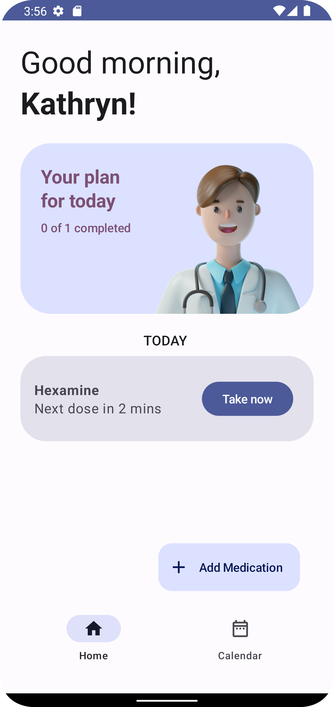
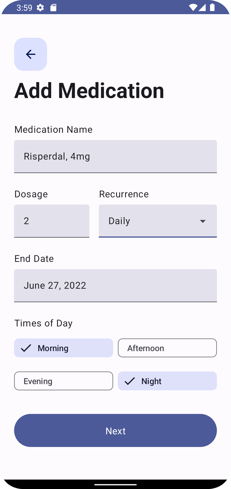
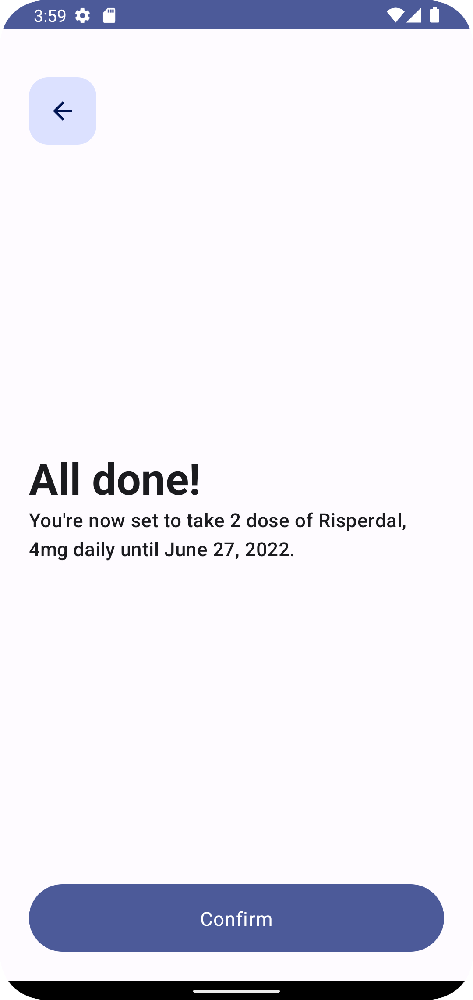

<h1 align="center">Dose App 💊 [Work in progress 🚧]</h1>

    <a href="https://github.com/waseefakhtar/dose-android/discussions">Discussions</a> •
    <a href="https://github.com/waseefakhtar/dose-android/blob/main/LICENSE">License</a> •
    <a href="https://twitter.com/waseefakhtar">Twitter</a>
      
    
    <!---->
    
    

A work-in-progress Android app that reminds you medications exactly when your body needs them - Made with Jetpack Compose, Material Design 3, Room, Navigation Components, Kotlin Coroutines, Hilt, Firebase using the recommended <a href="https://developer.android.com/topic/architecture">Android Architecture Guidelines</a>.

I’m building it in public. So the idea is for everyone to contribute, leave comments, suggest ideas, etc using the <a href="https://github.com/waseefakhtar/dose-android/discussions">Discussions</a> tab.

You can also install & test the latest APK <a href="https://github.com/waseefakhtar/dose-android/blob/main/docs/release/app.apk">here</a>. 

## Screenshots

     

## Demo

https://user-images.githubusercontent.com/4093820/178681202-8ebd6102-5dc5-4e91-bb57-70e2dbf0f98a.mp4

## Features
- [x] Adds medications with its duration and daily dosage.
- [x] Displays a list of medications to take daily.
- [ ] Reminds when it's time to take medication with notifications.
- [ ] Shows history of dosage taken.
- [ ] Shows medications in a calendar view.

## IDE Version
Android Studio Chipmunk (2021.2.1)

## Contributions

If you've found an error in the project, please file an issue.

Patches are encouraged and may be submitted by forking this project and submitting a pull request. Since this project is still in its very early stages, if your change is substantial, please raise an issue first to discuss it.

## License

Dose App is distributed under the terms of the MIT License. See the
[license](LICENSE) for more information.
