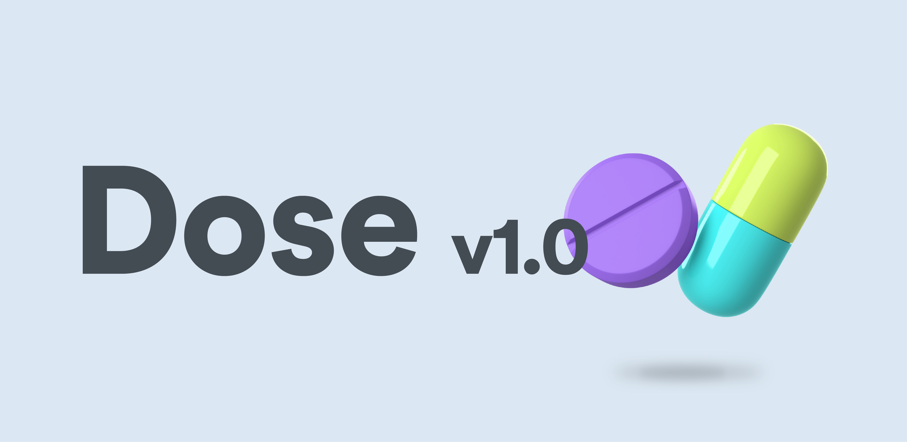

<h1 align="center">Dose App 💊 [Work in progress 🚧]</h1>

An Android app that reminds you medications exactly when your body needs them - Made with Jetpack Compose, Hilt, Coroutines, Retrofit, ViewModel, Flow, Navigation based on MVVM architecture

## Demo

Coming soon.

## Features
- Adds medications with its duration and daily dosage.
- Displays a list of medications to take daily.
- Reminds when it's time to take medication.
- Shows history of dosage taken.
- Shows medications in a calendar view.

## IDE Version
Android Studio Chipmunk (2021.2.1)
