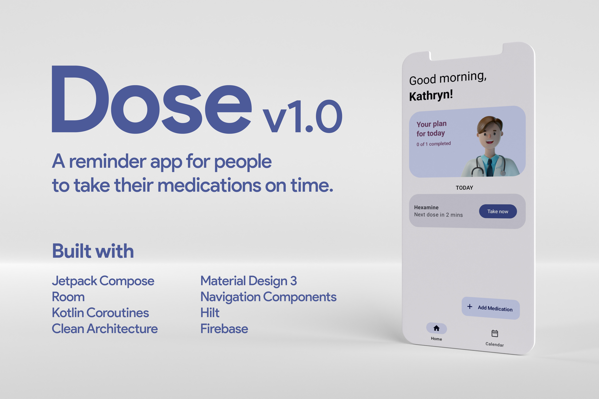

<h1 align="center">Dose App 💊 [Work in progress 🚧]</h1>

An work-in-progress Android app that reminds you medications exactly when your body needs them - Made with Jetpack Compose, Material Design 3, Room, Navigation Components, Kotlin Coroutines, Hilt, Firebase using the recommended <a href="https://developer.android.com/topic/architecture">Android Architecture Guidelines</a>.

## Demo

Coming soon.

## Features
- Adds medications with its duration and daily dosage.
- Displays a list of medications to take daily.
- Reminds when it's time to take medication.
- Shows history of dosage taken.
- Shows medications in a calendar view.

## IDE Version
Android Studio Chipmunk (2021.2.1)

## License

Dose App is distributed under the terms of the MIT License. See the
[license](LICENSE) for more information.
