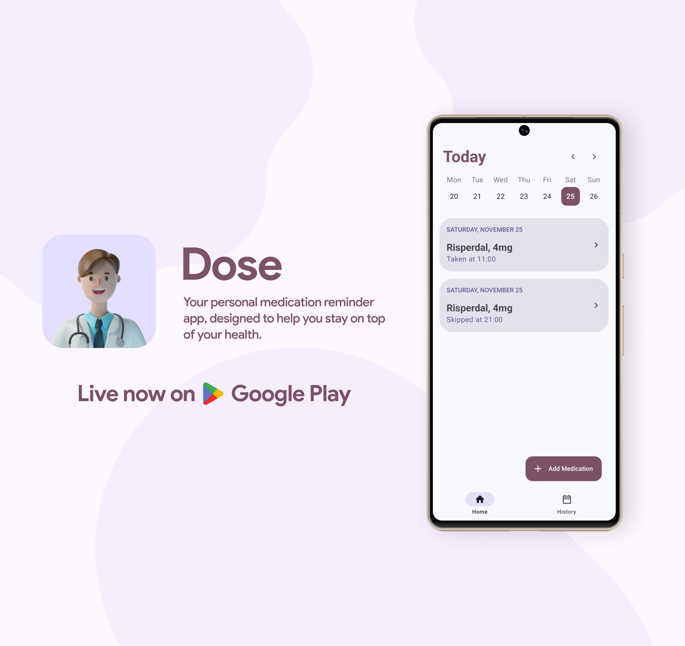

<h1 align="center">Dose App 💊⏰</h1>

  
  
  
  
   
  
  
   
  

 

Dose is a medication reminder app for Android, designed to help you stay on top of your health by reminding you to take your medications on time — Made with Jetpack Compose, Material Design 3, Room, Navigation Components, Kotlin Coroutines, Hilt, Firebase using the recommended <a href="https://developer.android.com/topic/architecture">Android Architecture Guidelines</a>.

I’m building it in public. So the idea is for everyone to contribute, leave feedback, suggest ideas, and collaborate!

Got any crazy new ideas? Head over to the <a href="https://github.com/waseefakhtar/dose-android/discussions">Discussions</a> tab and start a new discussion.

## MAD Score

## IDE Version
Android Studio Koala | 2024.1.1

## Contributions

If you've found an error in the project, please file an issue.

Patches are encouraged and may be submitted by forking this project and submitting a pull request. Since this project is still in its very early stages, if your change is substantial, please raise an issue first to discuss it.

## License

Dose App is distributed under the terms of the MIT License. See the
[license](LICENSE) for more information.
